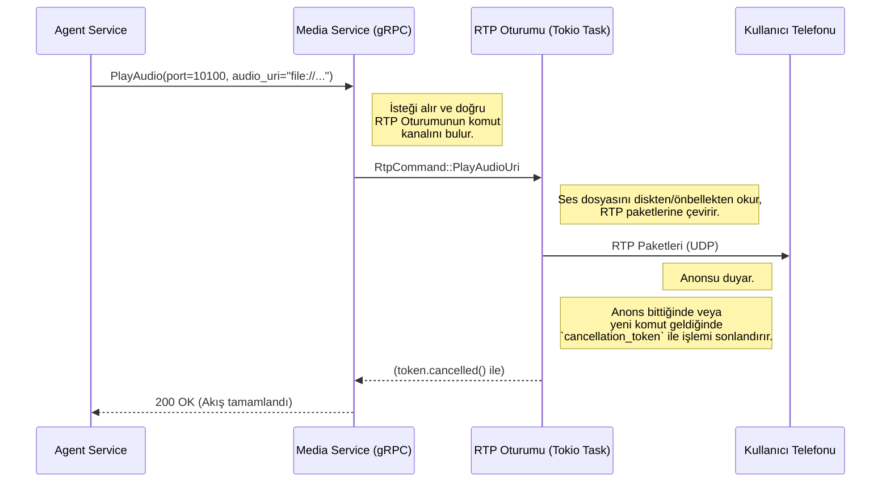
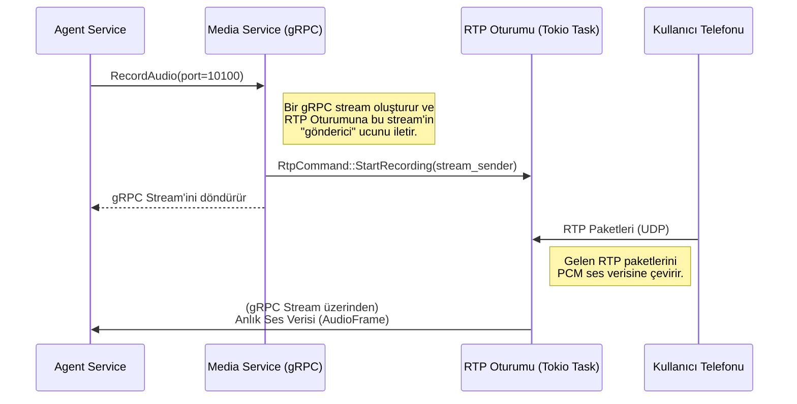

# 🎙️ Sentiric Media Service - Mantık ve Akış Mimarisi

**Belge Amacı:** Bu doküman, `media-service`'in Sentiric platformunun **gerçek zamanlı medya motoru** olarak stratejik rolünü, temel çalışma prensiplerini ve diğer servislerle olan etkileşim akışını açıklar. `TASKS.md` "ne inşa edileceğini", bu doküman ise "neden ve nasıl çalıştığını" anlatır.

---

## 1. Stratejik Rol: "Ağız ve Kulak" (The Mouth and Ears)

Bu servis, platformun dış dünya ile **sesli iletişim kurmasını** sağlayan tek bileşendir. Diğer tüm servisler mantık ve veri üzerine odaklanırken, `media-service` ham ses paketlerini (RTP) gönderme ve alma gibi düşük seviyeli ve yüksek performans gerektiren işlerden sorumludur.

**Bu servis sayesinde platform:**
1.  **Konuşabilir:** `agent-service`'ten gelen "bu sesi çal" komutunu alıp, bu sesi bir telefon aramasındaki kullanıcıya duyulabilir RTP paketleri olarak gönderir.
2.  **Dinleyebilir:** Bir telefon aramasındaki kullanıcının konuşmasını RTP paketleri olarak alır ve bunu anlık olarak `agent-service`'e (ve oradan `stt-service`'e) iletilebilecek bir gRPC stream'ine dönüştürür.
3.  **Verimli Olur:** Sık kullanılan ses dosyalarını (`welcome.wav` gibi) hafızada önbelleğe alarak disk okuma operasyonlarını en aza indirir.
4.  **Dayanıklı Olur:** Kullanılan RTP portlarını bir "karantina" mekanizması ile yöneterek, aynı portun çok hızlı bir şekilde tekrar kullanılıp çakışmalara yol açmasını engeller.

---

## 2. Temel Çalışma Prensibi: Port Yönetimi ve RTP Oturumları

Servis, her bir çağrı için bağımsız bir "RTP Oturumu" yönetir.

*   **Port Tahsisi (`AllocatePort`):** `sip-signaling-service` bir çağrı başlattığında, bu servisten bir UDP portu talep eder. `media-service`, havuzundan uygun bir port bulur, bu portu dinleyecek bir `rtp_session_handler` (Tokio task) başlatır ve port numarasını geri döner.
*   **Komut İşleme:** Başlatılan her `rtp_session_handler`, bir komut kanalı (mpsc channel) üzerinden komutları dinler. `agent-service`'ten gelen `PlayAudio` veya `RecordAudio` gibi komutlar bu kanala gönderilir.
*   **Medya Akışı:** Oturum yöneticisi, aldığı komuta göre ya belirtilen ses dosyasını RTP paketlerine çevirip kullanıcıya gönderir ya da kullanıcıdan gelen RTP paketlerini alıp `agent-service`'e stream eder.
*   **Port Serbest Bırakma (`ReleasePort`):** Çağrı bittiğinde, `sip-signaling-service` bu RPC'yi çağırır. İlgili oturum yöneticisine `Shutdown` komutu gönderilir, task sonlanır ve kullanılan port karantinaya alınır.

---

## 3. Uçtan Uca Akışlar

### Senaryo 1: Anons Çalma (`PlayAudio`)

### Senaryo 2: Canlı Ses Kaydı/Akışı (RecordAudio)
