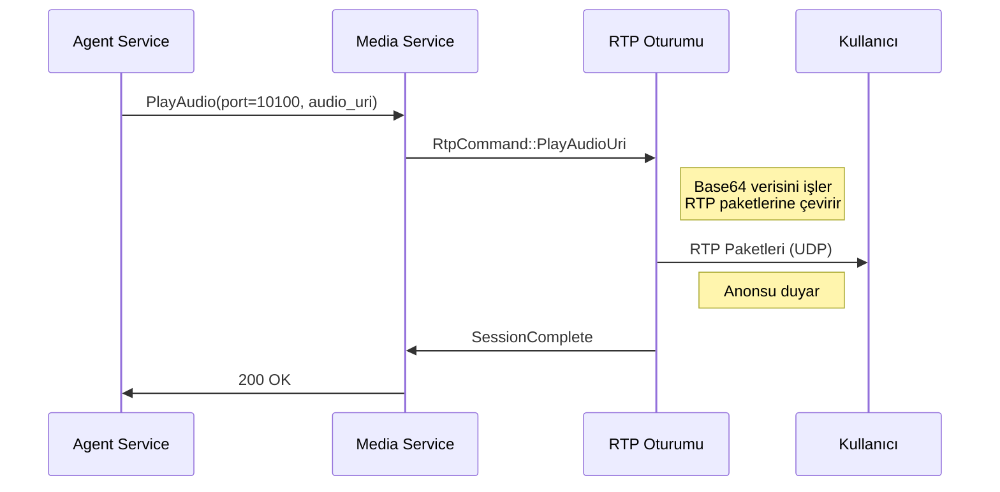
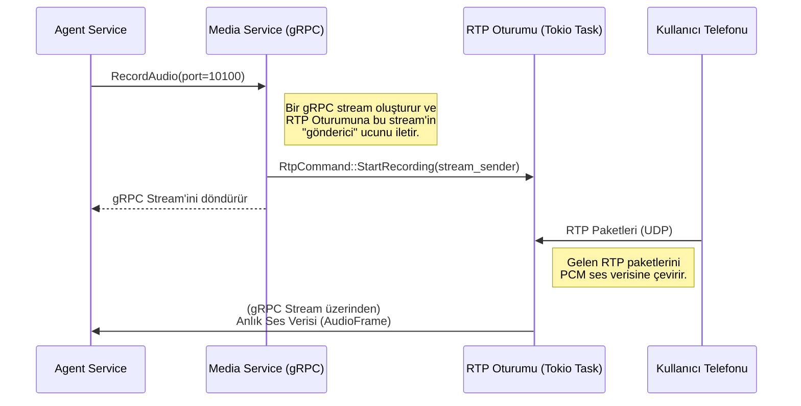
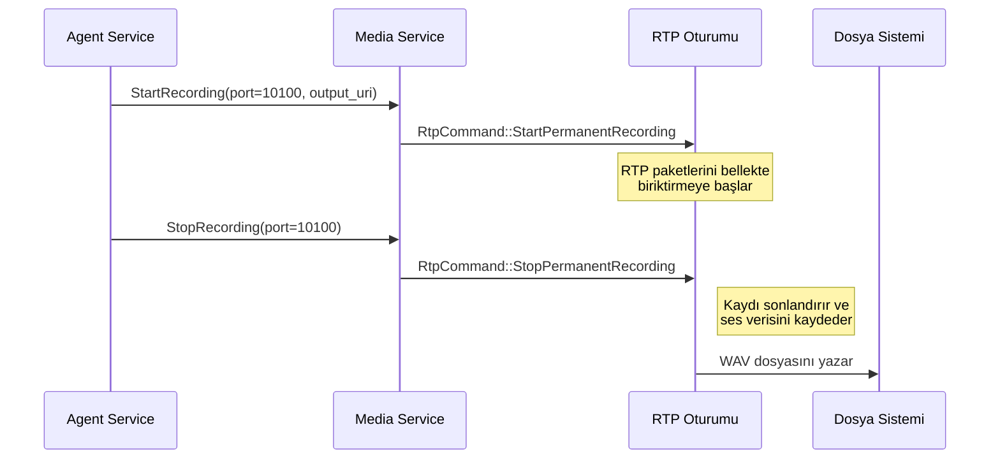

# 🎙️ Sentiric Media Service - Mantık ve Akış Mimarisi

**Belge Amacı:** Bu doküman, `media-service`'in Sentiric platformunun **gerçek zamanlı medya motoru** olarak stratejik rolünü, temel çalışma prensiplerini ve diğer servislerle olan etkileşim akışını açıklar. `TASKS.md` "ne inşa edileceğini", bu doküman ise "neden ve nasıl çalıştığını" anlatır.

---

## 1. Stratejik Rol: "Ağız ve Kulak" (The Mouth and Ears)

Bu servis, platformun dış dünya ile **sesli iletişim kurmasını** sağlayan tek bileşendir. Diğer tüm servisler mantık ve veri üzerine odaklanırken, `media-service` ham ses paketlerini (RTP) gönderme ve alma gibi düşük seviyeli ve yüksek performans gerektiren işlerden sorumludur.

**Bu servis sayesinde platform:**
1.  **Konuşabilir:** `agent-service`'ten gelen "bu sesi çal" komutunu alıp, bu sesi bir telefon aramasındaki kullanıcıya duyulabilir RTP paketleri olarak gönderir.
2.  **Dinleyebilir:** Bir telefon aramasındaki kullanıcının konuşmasını RTP paketleri olarak alır ve bunu anlık olarak `agent-service`'e (ve oradan `stt-service`'e) iletilebilecek bir gRPC stream'ine dönüştürür.
3.  **Verimli Olur:** Sık kullanılan ses dosyalarını (`welcome.wav` gibi) hafızada önbelleğe alarak disk okuma operasyonlarını en aza indirir.
4.  **Dayanıklı Olur:** Kullanılan RTP portlarını bir "karantina" mekanizması ile yöneterek, aynı portun çok hızlı bir şekilde tekrar kullanılıp çakışmalara yol açmasını engeller.

---

## 2. Temel Çalışma Prensibi: Merkezi Durum ve Bağımsız Oturumlar

Servis, `AppState` adında merkezi bir paylaşılan durum (`state`) ve her bir çağrı için bağımsız bir "RTP Oturumu" (`Tokio Task`) mantığıyla çalışır.

*   **`AppState` (Merkezi Durum):** `PortManager` (kullanılabilir/karantinadaki portlar) ve `AudioCache` (hafızadaki ses dosyaları) gibi tüm servis genelindeki kaynakları tutan `Arc<Mutex<...>>` yapısıdır.
*   **Port Tahsisi (`AllocatePort`):** `sip-signaling-service` bir çağrı başlattığında, bu servisten bir UDP portu talep eder. `media-service`, `AppState`'teki `PortManager`'dan uygun bir port bulur, bu portu dinleyecek bir `rtp_session_handler` (Tokio task) başlatır ve port numarasını geri döner.
*   **Komut İşleme:** Başlatılan her `rtp_session_handler`, bir komut kanalı (mpsc channel) üzerinden komutları dinler. `agent-service`'ten gelen `PlayAudio`, `RecordAudio`, `StartRecording` gibi komutlar bu kanala gönderilir.
*   **Medya Akışı ve İşleme:** Oturum yöneticisi, aldığı komuta göre:
    *   `file://` URI'si için sesi önbellekten/disk'ten okur.
    *   `data:` URI'si için sesi Base64'ten çözümler.
    *   Bu sesi RTP paketlerine çevirip kullanıcıya gönderir (konuşma).
    *   Kullanıcıdan gelen RTP paketlerini alıp PCM verisine çevirir ve `agent-service`'e stream eder (dinleme).
*   **Port Serbest Bırakma (`ReleasePort`):** Çağrı bittiğinde, ilgili oturum yöneticisine `Shutdown` komutu gönderilir, task sonlanır ve port `AppState`'teki `PortManager` tarafından karantinaya alınır.

---

## 3. Uçtan Uca Akışlar

### Senaryo 1: Anons Çalma (`PlayAudio`)

Bu senaryo, hem diskteki bir dosyayı (`file://`) hem de TTS tarafından üretilen anlık sesi (`data:`) çalmayı kapsar.

### Senaryo 2: Canlı Ses Akışı (`RecordAudio`)

### Senaryo 3: Kalıcı Çağrı Kaydı (`StartRecording`/`StopRecording`)

---

## 4. Kritik Tasarım Kararları ve Faydaları

*   **Tokio Task'ler ve Kanallar:** Her RTP oturumunun bağımsız bir Tokio Task olarak çalışması, bir çağrıdaki sorunun diğer çağrıları etkilememesini sağlar (hata izolasyonu). Kanallar, task'ler arasında güvenli ve verimli iletişim sağlar.
*   **Port Karantinası:** Bir port serbest bırakıldığında hemen kullanıma açılmaz, belirli bir süre karantinada kalır. Bu, ağ üzerinde hala bu porta gönderilmekte olan "geç kalmış" paketlerin (late packets) yeni bir çağrıya karışmasını önler.
*   **Ses Önbelleği (AudioCache):** Sık kullanılan ses dosyalarının RAM'de tutulması, her oynatma isteğinde diske erişim gereksinimini ortadan kaldırarak gecikmeyi (latency) büyük ölçüde azaltır ve IO yükünü hafifletir.
*   **URI Esnekliği:** `file://` ve `data:` URI şemalarını desteklemek, servise hem önceden kaydedilmiş hem de dinamik olarak (TTS'ten) üretilmiş sesleri oynatma esnekliği kazandırır.
*   **İptal Token'ları:** Uzun süren ses oynatma işlemleri, yeni bir komut geldiğinde (örneğin kullanıcı konuşmaya başladı) hemen iptal edilebilir. Bu, doğal ve kesintisiz bir konuşma akışı sağlamak için kritiktir.

Bu mimari, yüksek eşzamanlı çağrı hacmini karşılamak için hafif, ölçeklenebilir ve hataya dayanıklı bir medya işleme katmanı sunar.

## 🏛️ Çağrı Kayıt Mimarisi: Teknik Doğruluk vs. Dinlenebilirlik

`media-service`, çağrı kayıtlarını depolarken **teknik doğruluğu** önceliklendirir. Bir telefon görüşmesi sırasında 8kHz'lik sesin sistemin iç standardı olan 16kHz'e dönüştürülmesi gibi tüm teknik süreçler, kayda olduğu gibi yansıtılır. Bu, STT (Speech-to-Text) entegrasyonu ve adli analiz için en doğru veriyi sağlar.

Bu teknik yaklaşım, ham kayıt dosyalarının insan kulağına doğal gelmeyen, perdesi yüksek ("hızlı") bir sese sahip olmasına neden olur. Bu, **beklenen bir davranıştır ve sistemin doğru çalıştığının bir göstergesidir.**

Kullanıcıların bu kayıtları dinlemesi gerektiğinde, `media-service`'in sağladığı `GetPlayableRecording` RPC'si kullanılmalıdır. Bu endpoint, S3'teki ham teknik kaydı anlık olarak işleyerek, perdesi düzeltilmiş ve insan kulağına doğal gelen bir ses akışı sunar.

**Özetle:**
-   **Depolama (`S3 URI`):** Ham, teknik, perdesi yüksek kayıt. **Sadece makineler (STT, analiz araçları) ve `media-service`'in kendisi tarafından kullanılmalıdır.**
-   **Sunum (`GetPlayableRecording` RPC):** İşlenmiş, doğal sesli akış. **Tüm son kullanıcı arayüzleri (CDR, Yönetici Paneli vb.) kayıt dinletmek için bu RPC'yi kullanmalıdır.**