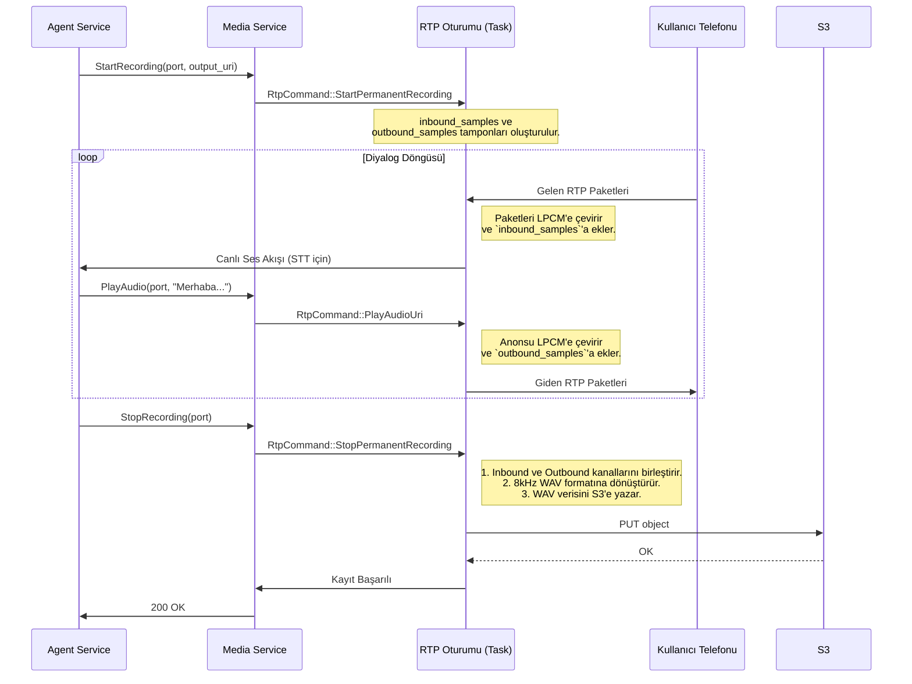

# 🎙️ Sentiric Media Service - Mantık ve Akış Mimarisi

**Belge Amacı:** Bu doküman, `media-service`'in Sentiric platformunun **gerçek zamanlı medya motoru** olarak stratejik rolünü, temel çalışma prensiplerini ve diğer servislerle olan etkileşim akışını açıklar. `TASKS.md` "ne inşa edileceğini", bu doküman ise "neden ve nasıl çalıştığını" anlatır.

---

## 1. Stratejik Rol: "Ağız ve Kulak" (The Mouth and Ears)

Bu servis, platformun dış dünya ile **sesli iletişim kurmasını** sağlayan tek bileşendir. Diğer tüm servisler mantık ve veri üzerine odaklanırken, `media-service` ham ses paketlerini (RTP) gönderme ve alma gibi düşük seviyeli ve yüksek performans gerektiren işlerden sorumludur.

**Bu servis sayesinde platform:**
1.  **Konuşabilir:** `agent-service`'ten gelen "bu sesi çal" komutunu alıp, bu sesi bir telefon aramasındaki kullanıcıya duyulabilir RTP paketleri olarak gönderir.
2.  **Dinleyebilir:** Bir telefon aramasındaki kullanıcının konuşmasını RTP paketleri olarak alır ve bunu anlık olarak `agent-service`'e (ve oradan `stt-service`'e) iletilebilecek bir gRPC stream'ine dönüştürür.
3.  **Kaydedebilir:** Konuşmanın her iki yönünü de (`kullanıcı` ve `bot`) alıp, bunları tek bir ses dosyasında birleştirerek kalıcı depolama için S3'e yazar.
4.  **Verimli Olur:** Sık kullanılan ses dosyalarını (`welcome.wav` gibi) hafızada önbelleğe alarak disk okuma operasyonlarını en aza indirir.
5.  **Dayanıklı Olur:** Kullanılan RTP portlarını bir "karantina" mekanizması ile yöneterek, aynı portun çok hızlı bir şekilde tekrar kullanılıp çakışmalara yol açmasını engeller.

---

## 2. Temel Çalışma Prensibi: Merkezi Durum ve Bağımsız Oturumlar

Servis, `AppState` adında merkezi bir paylaşılan durum (`state`) ve her bir çağrı için bağımsız bir "RTP Oturumu" (`Tokio Task`) mantığıyla çalışır.

*   **`AppState` (Merkezi Durum):** `PortManager`, `AudioCache`, `S3Client` gibi tüm servis genelindeki kaynakları tutan `Arc<...>` yapısıdır.
*   **Port Tahsisi (`AllocatePort`):** Bir çağrı başladığında, `media-service` uygun bir UDP portu bulur, bu portu dinleyecek bir `rtp_session_handler` (Tokio task) başlatır ve port numarasını geri döner.
*   **Komut İşleme:** Başlatılan her `rtp_session_handler`, bir komut kanalı (mpsc channel) üzerinden komutları dinler. `agent-service`'ten gelen `PlayAudio`, `RecordAudio`, `StartRecording` gibi komutlar bu kanala gönderilir.
*   **Çift Yönlü Medya Akışı:** Oturum yöneticisi, aldığı komutlara ve gelen RTP paketlerine göre:
    *   **Giden Ses (Outbound):** `PlayAudio` komutuyla gelen ses verisini (dosyadan veya TTS'ten) RTP paketlerine çevirip kullanıcıya gönderir. Bu ses örnekleri, kalıcı kayıt için `outbound_samples` tamponunda biriktirilir.
    *   **Gelen Ses (Inbound):** Kullanıcıdan gelen RTP paketlerini alır, LPCM ses verisine çevirir. Bu veri, hem `RecordAudio` gRPC stream'i üzerinden anlık olarak `agent-service`'e gönderilir, hem de kalıcı kayıt için `inbound_samples` tamponunda biriktirilir.
*   **Kayıt ve Sonlandırma:** `StopRecording` komutu geldiğinde, `inbound_samples` ve `outbound_samples` tamponlarındaki ses verileri birleştirilir, standart formata (8kHz WAV) dönüştürülür ve S3'e yazılır. Çağrı bittiğinde (`ReleasePort`), oturum sonlandırılır ve port karantinaya alınır.

---

## 3. Uçtan Uca Akış: Kalıcı Kayıt ile Çift Yönlü Bir Diyalog

---

## 4. Kritik Tasarım Kararları ve Faydaları

*   **Tokio Task'ler ve Kanallar:** Her RTP oturumunun bağımsız bir Tokio Task olarak çalışması, bir çağrıdaki sorunun diğer çağrıları etkilememesini sağlar (hata izolasyonu).
*   **Ayrı Ses Tamponları (Inbound/Outbound):** Gelen ve giden sesin ayrı tamponlarda biriktirilip sadece kayıt sonunda birleştirilmesi, canlı ses akışı sırasında oluşabilecek karmaşıklığı ve performans sorunlarını önler. Bu, temiz ve hatasız bir ses birleştirme sağlar.
*   **Port Karantinası:** Bir port serbest bırakıldığında hemen kullanıma açılmaz. Bu, ağ üzerinde hala bu porta gönderilmekte olan "geç kalmış" paketlerin yeni bir çağrıya karışmasını önler.
*   **URI Esnekliği:** `file://` ve `data:` URI şemalarını desteklemek, servise hem önceden kaydedilmiş hem de dinamik olarak (TTS'ten) üretilmiş sesleri oynatma esnekliği kazandırır.

---
