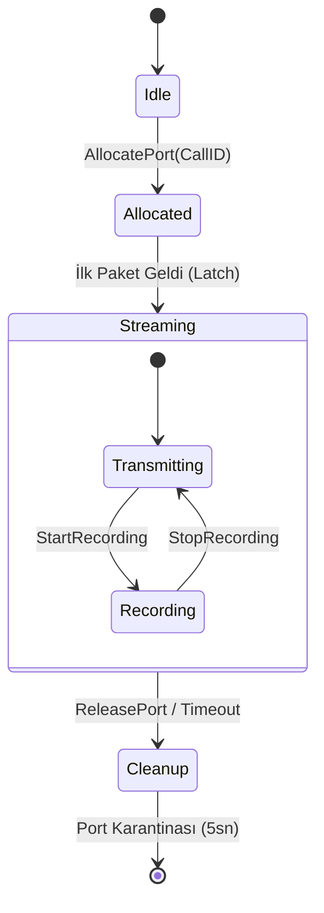

# 🎙️ Sentiric Media Service - Mantık Mimarisi (Nihai)

**Rol:** Gerçek Zamanlı Medya Motoru.

## 1. RTP Oturum Yönetimi ve "Latching" Kuralı
Media Service, NAT arkasındaki cihazlarla çalışmak için "Latching" (Kilitlenme) kullanır.

*   **KRİTİK UYARI:** Latching mekanizmasının çalışabilmesi için karşı tarafın paketi **doğru UDP portuna** göndermesi şarttır. 
*   Eğer SBC veya B2BUA karşı tarafa yanlış port ilan ederse (Port Split), Media Service asla paket alamaz ve Latching gerçekleşmez.

1.  **Port Tahsisi (Allocate):**
    *   `b2bua` veya `agent` port ister.
    *   Sistem uygun çift (RTP/RTCP) portu bulur ve dinlemeye başlar.

2.  **NAT Delme (Aggressive Hole Punching):**
    *   **KRİTİK:** Karşı taraftan ses gelmesini beklemeden, hedef IP'ye boş paketler gönderir.
    *   Bu, firewall'da delik açar ve sesin bize ulaşmasını sağlar.

3.  **Kilitlenme (Latching):**
    *   İlk gelen geçerli RTP paketinin Kaynak IP'sine kilitlenir.
    *   SDP'de yazan IP yanlış olsa bile (NAT arkası), sesin geldiği yere cevap verir.

4.  **Çift Yönlü Akış (Pipeline):**
    *   **Gelen Ses (RX):** `PCMU/A` -> `LPCM 16k` -> `gRPC Stream` (Agent/STT'ye gider).
    *   **Giden Ses (TX):** `TTS` -> `LPCM 16k` -> `G.711` -> `RTP` (Kullanıcıya gider).

## 2. Yaşam Döngüsü

---
