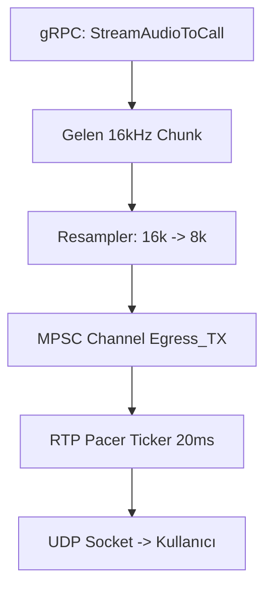

# 🧬 Media Service Domain Logic & RTP Engine

Bu belge, `media-service`'in yüksek trafikli telefon görüşmelerini (RTP) yönetirken Linux çekirdeğini (Kernel) ve RAM'i nasıl koruduğunu açıklar.

## 1. Port Quarantine (Karantina) Mekanizması
RTP portları (Örn: 50000-50100) sınırlıdır. Bir çağrı bittiğinde port hemen havuza (Available Ports) geri dönerse, ağda geç kalan (Late Arrival) veya yönlendiricide takılan eski ses paketleri, yeni başlayan başka bir çağrının içine sızar (Cross-Talk / Hat Karışması).
* **Kural:** `ReleasePort` çağrıldığında, port `quarantined_ports` listesine alınır ve **kesinlikle 2 saniye boyunca** yeni çağrılara tahsis edilmez. Bu bekleme süresi `run_reclamation_task` tarafından yönetilir.

## 2. Disk-Free (Zero-Copy) S3 Upload
Çağrı ses kayıtları (WAV) diske (Harddrive) yazılmaz. Diske yazmak, yüksek eşzamanlı (Concurrent) çağrılarda I/O darboğazı yaratır.
* **Algoritma:** Çağrı boyunca RX (Müşteri) ve TX (Yapay Zeka) sesleri RAM'de iki ayrı vektörde (`Vec<i16>`) birikir. Çağrı bittiğinde, `spawn_blocking` içinde bu iki kanal birleştirilir (Stereo Interleaving), WAV header'ı eklenir ve doğrudan RAM'den `aws_sdk_s3` kullanılarak MinIO/S3'e fırlatılır (ByteStream). 
* **OOM Koruması:** Eğer çağrı çok uzun sürerse (Örn: `MAX_SAMPLES = 57,600,000`), sistem RAM'i korumak için kaydı sessizce durdurur.

## 3. Asenkron Ses Akışı (Stream Egress)

```mermaid
graph TD
    A[gRPC: StreamAudioToCall] --> B[Gelen 16kHz Chunk]
    B --> C[Resampler: 16k -> 8k]
    C --> D[MPSC Channel Egress_TX]
    D --> E[RTP Pacer Ticker 20ms]
    E --> F[UDP Socket -> Kullanıcı]
```
Eğer AI motoru 10 saniye boyunca hiç ses göndermezse, gRPC bağlantısı "Zombie Task" olmamak için `STREAM_IDLE_TIMEOUT` tarafından acımasızca kesilir (Drop).
