# 🎙️ Sentiric Media Service - Mantık Mimarisi (Final)

**Rol:** Gerçek Zamanlı Medya Motoru. RTP İşleme, Kayıt ve Transcoding.

## 1. RTP Oturum Yönetimi (The Session Loop)

Her çağrı için bağımsız bir `Tokio Task` başlatılır. Akış şöyledir:

1.  **Port Tahsisi (Allocate):**
    *   `b2bua` veya `agent` port ister.
    *   Sistem uygun çift (RTP/RTCP) portu bulur ve dinlemeye başlar.

2.  **NAT Delme (Aggressive Hole Punching):**
    *   **KRİTİK:** Karşı taraftan ses gelmesini beklemeden, hedef IP'ye boş paketler gönderir.
    *   Bu, firewall'da delik açar ve sesin bize ulaşmasını sağlar.

3.  **Kilitlenme (Latching):**
    *   İlk gelen geçerli RTP paketinin Kaynak IP'sine kilitlenir.
    *   SDP'de yazan IP yanlış olsa bile (NAT arkası), sesin geldiği yere cevap verir.

4.  **Çift Yönlü Akış (Pipeline):**
    *   **Gelen Ses (RX):** `PCMU/A` -> `LPCM 16k` -> `gRPC Stream` (Agent/STT'ye gider).
    *   **Giden Ses (TX):** `TTS` -> `LPCM 16k` -> `G.711` -> `RTP` (Kullanıcıya gider).

## 2. Yaşam Döngüsü

```mermaid
stateDiagram-v2
    [*] --> Idle
    Idle --> Allocated : AllocatePort(CallID)
    Allocated --> Streaming : İlk Paket Geldi (Latch)
    
    state Streaming {
        [*] --> Transmitting
        Transmitting --> Recording : StartRecording
        Recording --> Transmitting : StopRecording
    }
    
    Streaming --> Cleanup : ReleasePort / Timeout
    Cleanup --> [*] : Port Karantinası (5sn)
```

---
