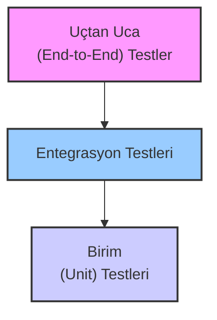

# 🎙️ Sentiric Media Service - Test Stratejisi

Bu doküman, `sentiric-media-service`'in kalitesini, güvenilirliğini ve performansını sağlamak için uyguladığımız çok katmanlı test stratejisini detaylandırmaktadır. Amacımız, her kod değişikliğinin production ortamında beklenmedik sorunlara yol açmasını proaktif olarak engellemektir.

## 1. Test Felsefemiz: Güven Piramidi

Test yaklaşımımız, klasik "Test Piramidi" modelini temel alır. Bu model, hızlı ve ucuz olan testlerden (birim testleri) daha yavaş ama daha kapsamlı olan testlere (entegrasyon, uçtan uca) doğru bir yapı sunar.

-   **Birim (Unit) Testleri (Yapılacak):** Hızlı, izole ve en temel katmandır.
-   **Entegrasyon Testleri (Mevcut):** Servislerin birbiriyle ve altyapıyla (MinIO, Docker Ağı) doğru konuştuğunu doğrular.
-   **Uçtan Uca (End-to-End) Testler (Mevcut):** Kullanıcı senaryolarını baştan sona simüle eder.

## 2. Test Katmanları ve Araçları

### Katman 1: Birim Testleri (`cargo test`) - (YAPILACAK)

Bu katman, henüz tam olarak implemente edilmemiş olsa da yol haritamızın önemli bir parçasıdır.

-   **Amaç:** Tek bir fonksiyonun veya modülün mantığını, diğer bileşenlerden tamamen izole bir şekilde doğrulamak.
-   **Örnekler:**
    -   `rtp/codecs.rs`: `decode_g711_to_lpcm16` fonksiyonuna bilinen bir PCMA byte dizisi verip, beklenen LPCM örneklerini üretip üretmediğini kontrol etmek.
    -   `state.rs`: `PortManager`'dan bir port alıp, karantinaya alıp, süresi dolduğunda tekrar havuza dönüp dönmediğini zamanı "mock" ederek (sahte zaman kullanarak) test etmek.
    -   URI parser'ların `file://` ve `data:` şemalarını doğru ayrıştırıp ayrıştırmadığını test etmek.
-   **Nasıl Çalıştırılır:** `cargo test`

### Katman 2: Entegrasyon ve Uçtan Uca Testler (`docker-compose.test.yml`) - (MEVCUT)

Bu, şu anki test stratejimizin bel kemiğidir. Gerçek bir çağrı akışının tüm kritik bileşenlerini içerir ve production ortamını yüksek doğrulukla simüle eder.

-   **Amaç:** `media-service`'in Docker ortamında, bağımlılıkları (MinIO, TLS sertifikaları, Docker ağı) ile birlikte tam bir sistem olarak doğru çalışıp çalışmadığını garanti altına almak.
-   **Kapsanan Senaryolar:**
    -   **Canlı Ses Akışı Doğrulaması (`live_audio_client`):**
        -   **Ne Test Ediliyor?** Bir istemcinin RTP (PCMU) paketleri gönderdiğinde, `media-service`'in bu paketleri alıp, doğru şekilde 16kHz LPCM'e dönüştürüp, `RecordAudio` gRPC stream'i üzerinden başka bir istemciye hatasız ve veri kaybı olmadan iletebildiği.
        -   **Neden Önemli?** Bu, STT (Speech-to-Text) entegrasyonunun temelini oluşturur. Sesin canlı olarak doğru formatta ve kalitede aktarıldığını garanti eder.
    -   **Kalıcı Kayıt Doğrulaması (`recording_client`):**
        -   **Ne Test Ediliyor?** `StartRecording` komutuyla başlayan bir oturumun, gelen RTP sesini biriktirip, `StopRecording` komutuyla sonlandığında, bu sesi standart formatta (`16kHz WAV`) bir S3 hedefine (MinIO) başarıyla yazabildiği.
        -   **Neden Önemli?** Yasal zorunluluklar ve kalite kontrolü için kritik olan çağrı kaydı özelliğinin güvenilirliğini sağlar. Bucket'ın var olmaması gibi altyapı sorunlarını yakalar.
    -   **Tam Diyalog Döngüsü ve Ses Birleştirme (`end_to_end_call_validator`):**
        -   **Ne Test Ediliyor?** Projenin en kapsamlı testi. Aynı anda hem kullanıcıdan gelen sesi (RTP), hem de sistemin kullanıcıya çaldığı anonsu (TTS simülasyonu) alıp, ikisini de **tek bir ses kaydında doğru formatta birleştirebildiği**. Ayrıca, gelen sesin canlı olarak STT'ye (simüle edilmiş) aktarıldığını da doğrular.
        -   **Neden Önemli?** Bu, `TASKS.md`'deki **MEDIA-REFACTOR-01** görevinin kabul kriteridir. Cızırtı, tek yönlü ses, yanlış format gibi en karmaşık hataları yakalamak için tasarlanmıştır. `agent-service`'in tam fonksiyonel olabilmesi için bu senaryonun kusursuz çalışması şarttır.
-   **Nasıl Çalıştırılır:** `docker-compose -f docker-compose.test.yml up --build --exit-code-from test-runner`

### Katman 3: Performans ve Stres Testleri (`call_simulator`) - (MEVCUT)

-   **Amaç:** Servisin belirli bir kaynak (CPU/bellek) altında ne kadar eş zamanlı çağrıyı kaldırabildiğini ölçmek ve performans darboğazlarını tespit etmek.
-   **Ne Test Ediliyor?** Değişken çağrı süreleri ve rastgele senaryolar (kısa IVR anonsları, uzun ajan görüşmeleri) ile servise gerçekçi bir yük bindirilir. `PERFORMANCE.md` belgesindeki metrikler bu test ile elde edilir.
-   **Neden Önemli?** Kapasite planlaması yapmak, production ortamı için doğru kaynak limitlerini belirlemek ve yüksek trafik altında servisin kararlı kalıp kalmadığını görmek için kritiktir.
-   **Nasıl Çalıştırılır:** (Genellikle yerel olarak) `cargo run --example call_simulator --release`

## 3. Test Ortamı ve Altyapısı

-   **Test Ortamı:** Docker Compose
-   **İzolasyon:** Her test çalıştırması, temiz ve sıfırdan oluşturulmuş container'lar ve volüm'ler ile başlar. Bu, bir önceki çalıştırmadan kalan verilerin test sonuçlarını etkilemesini engeller.
-   **CI/CD Entegrasyonu:** `docker-compose.test.yml` komutu, GitHub Actions gibi CI/CD platformlarına kolayca entegre edilebilir. Bu sayede, `main` branch'ine yapılan her `push` işlemi öncesinde tüm entegrasyon testleri otomatik olarak çalıştırılır ve sadece başarılı olan kodlar birleştirilir. (Bkz: `.github/workflows/docker-publish.yml`'a eklenecek bir "test" adımı)

---

Bu doküman, projenin test kültürünü ve kaliteye verdiği önemi net bir şekilde ortaya koyar. Hem mevcut durumu özetler hem de gelecekteki testler (birim testleri gibi) için bir yol haritası çizer. Kesinlikle projenin değerini artıracak bir ekleme olur.